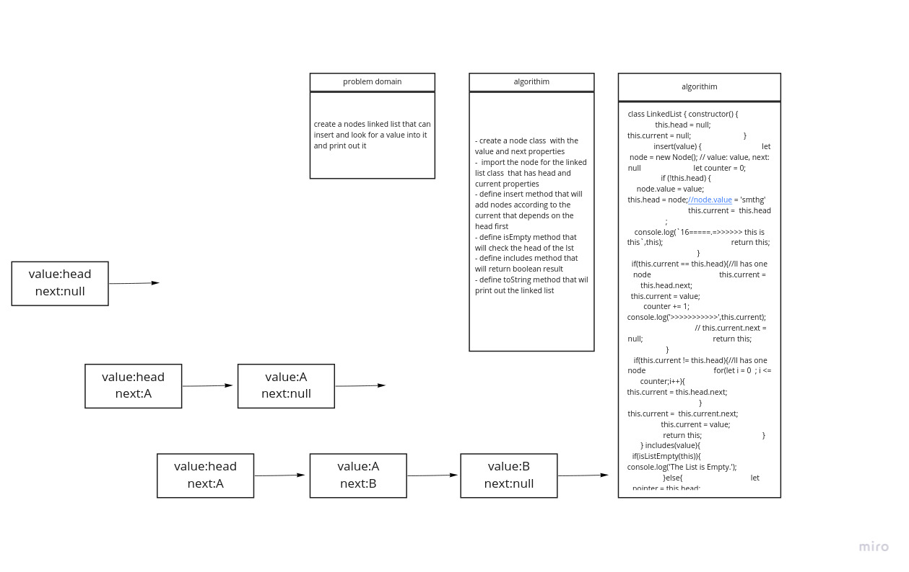

# data-structures-and-algorithms
# Singly Linked List

A linked list is a linear data structure where each element is a separate object. Linked list elements are linked using pointers. Each node of a list is made up of two items - the data and a reference to the next node. The last node has a reference to null.

# class 05

## Challenge

Implement Singly Linked List in javascript and implement a way to insert, search and get linked list values.

## Approach & Efficiency

- Create a Node class that has properties for the value stored in the Node, and a pointer to the next Node.
- LinkedList class, include a head property. Upon instantiation, an empty Linked List should be created.
- a method called insert which takes any value as an argument and adds a new node with that value to the head of the list with an O(1) Time performance.
- a method called includes which takes any value as an argument and returns a boolean result depending on whether that value exists as a Node’s value somewhere within the list.
- a method called toString  which takes in no arguments and returns a string representing all the values in the Linked List, formatted as:
"{ a } -> { b } -> { c } -> NULL"

### Bog O
- inser() -> time: O (1)
- include() -> time: O (n)
- toString() -> time: O (n)
## White Board

